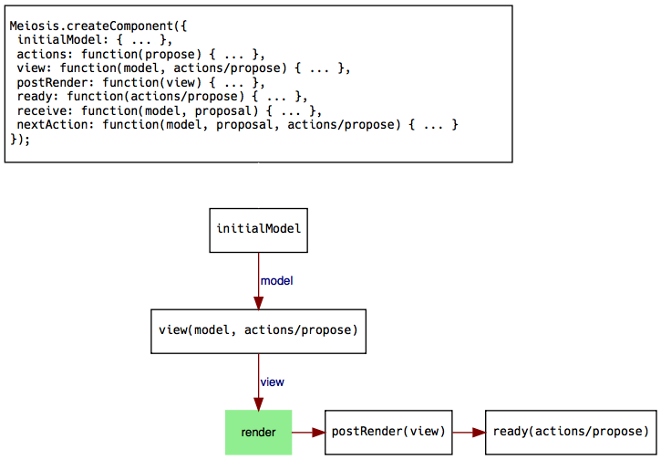
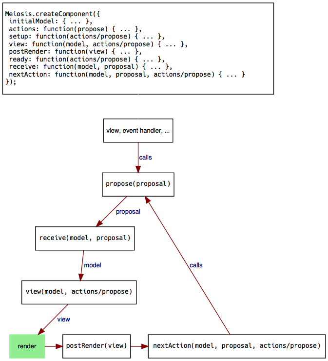

# Meiosis: The Big Picture

With the simple counter example from the previous chapters, we have seen the basics of using Meiosis. We saw how to initialize Meiosis with a renderer, how to create a component with `Meiosis.createComponent`, and how to run the application with `Meiosis.run`. We passed `initialModel`, `view`, and `receiveUpdate` to `createComponent`. Now, let's look at the other pieces that we can optionally use when creating Meiosis components.

## Initial flow

The diagram below shows every property that you can pass to `Meiosis.createComponent`. Remember that every property is *optional*. The diagram also shows how every piece of a component is called when you first run your application with `Meiosis.run`:

Again, every piece is optional, so if you do not specify a particular property when creating a component, that function in the diagram is simply skipped.

As you can see, this is what happens initially:

- The `initialModel` is passed to the `view`.
- Meiosis also passes the `actions` object to the `view` function.
- Meiosis takes the view returned by the `view` function and renders it, using the renderer that was configured with the `meiosis.init` function.
- If there is a `postRender` function, it gets called with the view.
- If there is a `ready` function, it gets called with the `actions` object.

## Update flow

After running your application, updates are what make things happen. The following diagram illustrates what happens when you call `action.sendUpdate` from the view, an event handler, and so on:

Updates are triggered when you call `actions.sendUpdate`:

- The update is passed to the `receiveUpdate` function. Meiosis also passes the latest model as the first parameter.
- The model returned by the `receiveUpdate` function becomes the latest model.
- The model is passed to the `view` function.
- Meiosis also passes the `actions` object to the `view` function.
- Meiosis takes the view returned by the `view` function and renders it, using the renderer that was configured with the `meiosis.init` function.
- If there is a `postRender` function, it gets called with the view.
- If there is a `nextUpdate` function, Meiosis calls it with the model, update, and `actions` object. The `nextUpdate` function decides whether to trigger another action by calling `actions.sendUpdate`.

These diagrams are meant as a cheatsheet that you can return to for reference. In the following chapters, we'll discuss each property that you can pass to `Meiosis.createComponent` in more detail.
