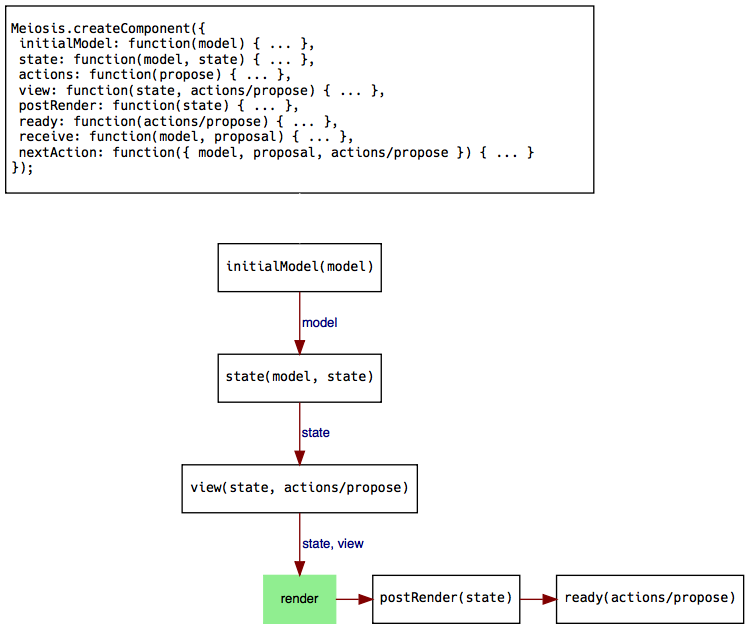

# Meiosis: The Big Picture

With the simple counter example from the previous chapters, we have seen the basics of using Meiosis. We saw how to initialize Meiosis with a renderer, how to create a component with `meiosis.createComponent`, and how to run the application with `meiosis.run`. We passed `initialModel`, `view`, and `receive` to `createComponent`. Now, let's look at the other pieces that we can optionally use when creating Meiosis components.

## Initial flow

The diagram below shows every property that you can pass to `Meiosis.createComponent`. Remember that every property is *optional*. The diagram also shows how every piece of a component is called when you first run your application with `Meiosis.run`:

Again, every piece is optional. If you do not specify a particular property, skip that function in the diagram.

As you can see, this is what happens initially:

- The `initialModel` is passed to the `view`.
- Meiosis also passes either the `actions` object or the `propose` function to the `view` function.
- Meiosis takes the view returned by the `view` function and renders it. Specify the renderer when calling the `meiosis.run` function.
- If there is a `postRender` function, it gets called with the view.
- If there is a `ready` function, it gets called with the `actions` object or the `propose` function.

## Propose/Receive flow

After running your application, propose/receive are what make things happen. The following diagram illustrates what happens when you call `propose` from the view, an event handler, and so on:

When you call `propose`:

- The proposal is passed to the `receive` function. Meiosis also passes the latest model as the first parameter.
- The model returned by the `receive` function becomes the latest model.
- The model is passed to the `view` function.
- Meiosis also passes the `actions` object or the `propose` function to the `view` function.
- Meiosis takes the view returned by the `view` function and renders it, using the renderer that was configured with the `meiosis.init` function.
- If there is a `postRender` function, it gets called with the view.
- If there is a `nextAction` function, Meiosis calls it with the model, proposal, and `actions` object or `propose` function. The `nextAction` function decides whether to trigger another action by calling `propose`.

These diagrams are a cheat-sheet that you can return to for reference. In the following chapters, we'll discuss each property that you can pass to `Meiosis.createComponent` in more detail.
