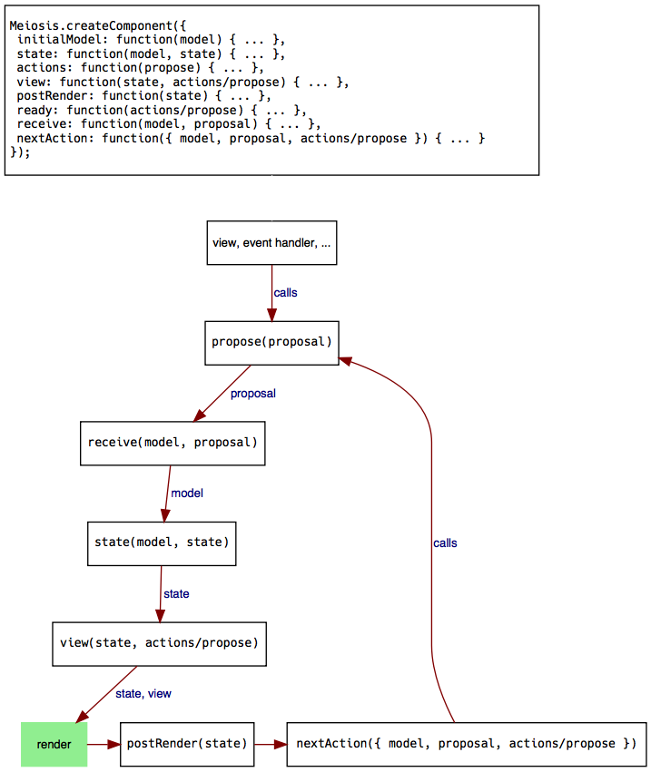

# Meiosis: The Big Picture

With the simple counter example from the previous sections, we have seen the basics of using Meiosis. We saw how to use a renderer, how to create a component with `meiosis.createComponent`, and how to run the application with `meiosis.run`. We passed `renderer`, `initialModel`, and `rootComponent` to `run`.  We passed `view`, `receive`, and `ready` to `createComponent`. Now, let's look at the all the properties that we can use when creating Meiosis components. We'll also see the sequence in which Meiosis calls each function.

## Initial Flow

The diagram below shows every property that you can pass to `meiosis.createComponent`. Remember that every property is optional. The diagram also shows how every piece of a component is called when you first run your application with `meiosis.run`:

If you do not specify a particular property, skip that function in the diagram.

As you can see, this is what happens initially:

- The `initialModel` is passed to the `state` function.
- The result of the `state` function (application state) is passed to the `view`. If there is no `state` function, the `initialModel` is passed instead.
- Meiosis also passes either the `actions` object or the `propose` function to the `view` function.
- Meiosis passes the model or application state and the root component to the renderer. Specify the `renderer`, the `initialModel`, and the `rootComponent` when calling the `meiosis.run` function.
- If there is a `postRender` function, it gets called with the view.
- If there is a `ready` function, it gets called with the `actions` object or the `propose` function.

## Propose/Receive Flow

After running your application, propose/receive are what make things happen. The following diagram illustrates what happens when you call `propose` from the view, an event handler, and so on:

When you call `propose`:

- The proposal is passed to the `receive` function. Meiosis also passes the latest model as the first parameter.
- The model returned by the `receive` function becomes the latest model.
- The latest model is passed to the `state` function. The result of the `state` function (application state) is passed to the `view`. If there is no `state` function, the lastest model is passed directly to the `view` function.
- Meiosis also passes the `actions` object or the `propose` function to the `view` function.
- Meiosis passes the model and the root component to the renderer.
- If there is a `postRender` function, it gets called with the view.
- If there is a `nextAction` function, Meiosis calls it with the model, proposal, and `actions` object or `propose` function. The `nextAction` function decides whether to trigger another action by calling `propose`.

These diagrams are a cheat-sheet that you can return to for reference. In the following sections, we'll discuss each property that you can pass to `meiosis.createComponent` in more detail.
