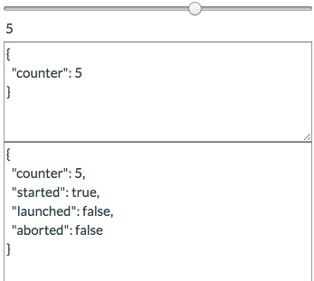
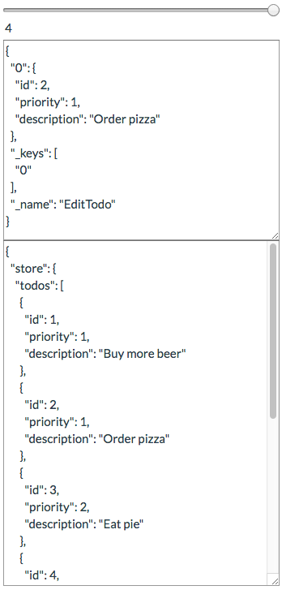

# Tracing and Debugging

[Meiosis-Tracer](https://github.com/foxdonut/meiosis-tracer) is a tracing and debugging tool for Meiosis. Use it to observe, rewind, and replay proposals within your application. The Tracer displays the proposal and resulting model for each step, and renders the resulting view. You can even enter your own model snapshot directly and instantly see how it affects the view.



## Adding a Container Element

First, add an HTML element to your page where you want to render the tracer. Give a way to identify it via a selector. For example:

```html
<div id="tracer" style="position: fixed; top: 0px; right: 0px;"></div>
```

We can target that `div` with the `"#tracer"` selector. We've also positioned it at the top right corner of the page.

## Creating the Tracer

Then, create the tracer by passing it the `createComponent` and `renderRoot` functions from your
`Meiosis` instance, along with the selector for the element into which to render the tracer:

```javascript
import { createComponent, run } from "meiosis";
import { renderer } from "meiosis-react";
import meiosisTracer from "meiosis-tracer";

const Main = createComponent({...});
const renderRoot = run(renderer.intoId(document, "app"), Main);
meiosisTracer(createComponent, renderRoot, "#tracer");
```

This will render the tracer into the element that has the `tracer` id.

## Using the Tracer

The tracer includes a slider control and two text areas. As you send proposals within your application, the tracer adds a snapshot. Each snapshot contains the proposal and resulting model. It increases the number of items in the slider by one. You can see a JSON representation of the proposal and the model in the first and second text area, respectively.



To rewind and replay proposals, use the slider. As you move across snapshots, you will see the view, proposal, and model reflect the snapshot on which you are on.

You can also enter your own model snapshot directly into the second text area. As you type, *provided you have entered valid JSON*, the view will reflect the result of rendering the model.

## Examples

The [todomvc](https://github.com/foxdonut/meiosis-examples/tree/master/examples/todomvc), [todo-list](https://github.com/foxdonut/meiosis-examples/tree/master/examples/todo-list), [rocket-laucher](https://github.com/foxdonut/meiosis-examples/tree/master/examples/rocket-launcher), and [requirejs](https://github.com/foxdonut/meiosis-examples/tree/master/examples/requirejs) examples use Meiosis-Tracer.
